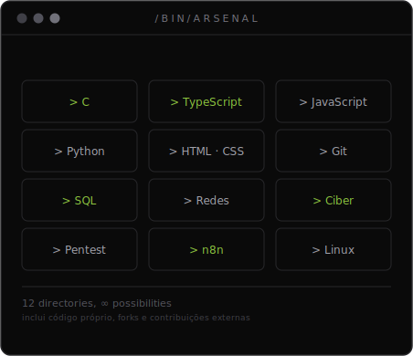
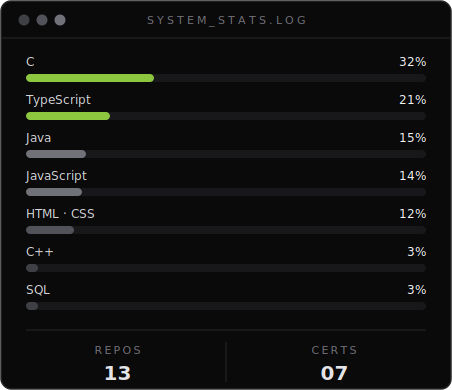

<!-- ═══════════════════════════════════════════════════════ -->
<!--  F E R B _ O S  —  github.com/davicalvarenga  -->
<!-- ═══════════════════════════════════════════════════════ -->

<!-- ── atividade real do GitHub ── -->

  

  

<i>"Se você só lê os livros que os outros estão lendo, você apenas pode pensar o mesmo que os outros estão pensando."</i> 📚

 

